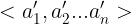

- something you should notice:
  - **In the description of alg / pseudocode, the array is begin at "1",not 0, But in the implement of alg , the array is begin at "0"**

## InsertionSort

- Insertion sort is a simple algorithm about sort, but is really easy to understand.

  - **the defination of "sorting question"**

    - Given the input as followed , output an array which is the permutation of the original one and **non-descending**.

      Input:A sequence of n numbers

      Output:A permutation of the input sequence such that 

      
    
      

  - **how does the insertion sort work?**

    - Precisely ,the algorithm work in a "inserting" way , that is, **finding a position** where the **key** is larger than previous one and less than the latter one and **inserting** it .

    - the process:

      - for the first time , there is no element in the "sorted" arry , of course , the first element in the array , called A[1] , is **bigger** than "nothing", and A[1] is placed in the first position of the "sorted array"

        - "bigger than nothing" : you can understand it like this in the array A[1..n], there is an "invisible"sentinel A[0] , whose value is so small  that no matter how small the value of A[1] is ,there always has : A[1] > A[0].

      - After the fisrt procedure, we have the sorted array A[1]. in the second procedure , what we should do is to "insert A[2]",which means we should compare the value of A[1] and A[2] to **decide which position** A[2] should be placed.

        - if A[2] is bigger than A[1], do nothing

        - if A[1] is bigger than A[2], we should insert A[2] in the position of A[1].

          -  What about A[1]? Overwrite?

            NO! we should record the value of A[2] ,using **key**  and move A[1] to the position of A[2].

      - And simply repeat..

  - **Pseudocode**
  
    ```c
    INSERTION-SORT(A)
     for j = 2 to A.length     //for j = 2; j<A.length+1;j++
     	key = A[j]               // record the value of A[j] and the A[1..j-1] is sorted
     	i = j - 1                // the last index of sorted array
     	while i>0 and A[i]>key   // if A[i] is bigger than key ,move behind.
     		A[i+1] = A[i]          
     		i = i - 1         
   	A[i+1] = key	          // the end of while gives the index of the element which is  	                         // less than key.   
    ```
  
    - The details you should pay attention to:
      - the overwrite of A[i+1] ?   NO!    **in fact , the A[i+1] = A[j] at the beginning of while ,is recorded in key** 
    - **Think about:**
    - why the alg begin at the end of sorted array?
      - what about the case that overwrite of A[i+1] where  i not equal to j -1?  I mean in the middle of the sorted array, A[i] is bigger than key, I should move A[i] to A[i+1] , A[i+1] is overwritten !

  - **Can we do better?**
  
    - review what the insertion sort alg do. Just two things !
      -  **First** : Find the appropriate position
      -  **Second** :Insert it
    - Improvement?
      - In the first : actually , what we do is to find a position in a sorted array. the good property of   sorted array make the improvement possible !
        - we can use the **binary search** to find the position !  we improved the linear time to find a position to the **lgn** time.
        - how binary search do?
          - if there is someone in the sorted array equal to key, we can insert key both in the previous position of it  and in the latter position.
          - if there don't exist an element equal to key, what should the position be?
      - **Actually , what we need is a position where key is larger than the previos and smaller than the latter.**
        - thus , we can define the return value of the binary search. 
          - **binary search  return the index of element ,which is <=key**
          - Fortunately , it can be done! lol
      - In the second : what we do is to move tones of element back, which is definitely slow.
        - Can we improve the second?
          - we can just change the "relation" between elements, which means ,we do not actually change the element in "memory ", but we change the relation , what i mean is something like this "A is the previous one of B ,and C is the successive one of B ".
        - Yeah ! the List ! We change the pointer !
      - Can we combine the two improvements? Unfortunately, we can not ! we can not do an binary search in the list.(Well, Actually , i don't know whether we can do that or not ... Common sense tell me that,lol)

  - **Implement**

    - I am learning python, so in this part i will try to implement the alg both in C and python. 

    - Acctually, I didn't promise my program can be correct in any input. I didn't have enough knowledge allowing me do such thing.But i will keep going on!
  
    - ```c
      //INSERTION-SORT(A)
      int INSERTION_SORT(int *A,int n) // array A[n]
      {
        int i = 0,key = 0;
        for(int j = 1 ; j < n ; j++){
        	key = A[j];
          i = j - 1;
          while(i>=0 && A[i]>key){
            A[i+1] = A[i]l
              i = i - 1;
          }
          A[i+1] = key;
        }
        return 0;
    }  
      ```
  
   - ```python
      def INSERTIONSORT(A):
          for j in range(1,len(A)):
              key = A[j]
              i = j-1
              while i>=0 and key < A[i]:
                  A[i+1] = A[i]
                  i = i - 1
            A[i+1] = key
      ```
      
  

